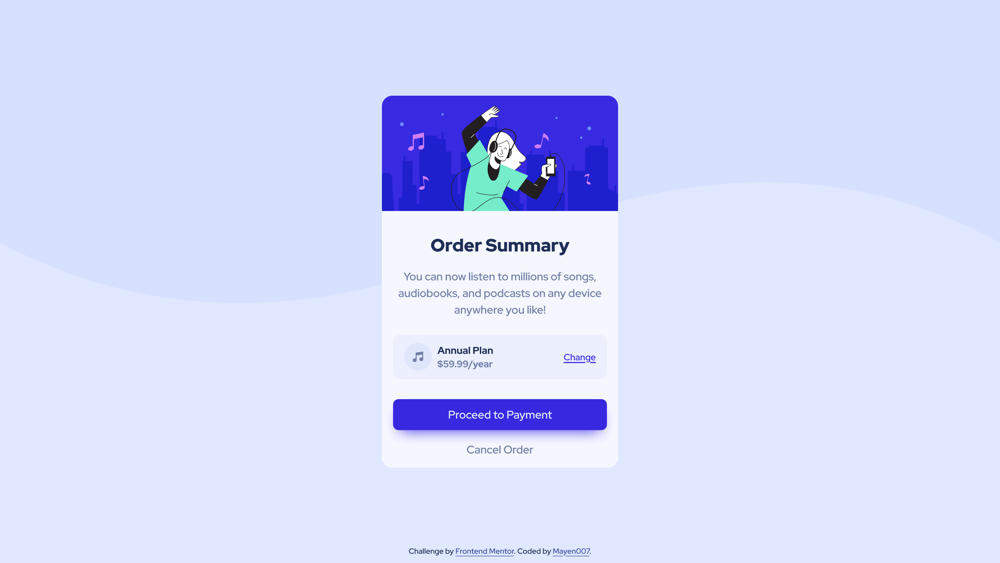

# Frontend Mentor - Order Summary Card Solution

This is my solution to the [Order Summary Card challenge on Frontend Mentor](https://www.frontendmentor.io/challenges/order-summary-component-QlPmajDUj). This project was a great opportunity to practice structuring a small, focused component while using semantic HTML and CSS.

## Table of Contents

- [Overview](#overview)
  - [The Challenge](#the-challenge)
  - [Screenshot](#screenshot)
  - [Links](#links)
- [My Process](#my-process)
  - [Built With](#built-with)
  - [What I Learned](#what-i-learned)
  - [Continued Development](#continued-development)
- [Author](#author)

## Overview

### The Challenge

Users should be able to:

- See hover states for interactive elements.

### Screenshot



### Links

- **Solution URL**: [Github Repository](https://github.com/Mayen007/order-summary-component)
- **Live Site URL**: [Live preview of the project](https://your-live-site-url.com)

## My Process

### Built With

- Semantic HTML5 markup
- CSS custom properties
- Flexbox for layout
- Mobile-first workflow
- Custom fonts using `@font-face` (Red Hat Display)

### What I Learned

This project helped solidify my understanding of **CSS custom properties**, **hover states**, and **responsive design**. One of the highlights was implementing a reusable and visually appealing button style:

```css
.card__button {
  background-color: var(--bright-blue);
  color: var(--pale-blue);
  border: none;
  border-radius: 8px;
  padding: 0.75rem 1.5rem;
  box-shadow: 0 10px 20px -10px var(--bright-blue);
  transition: all 0.3s ease;
}

.card__button:hover {
  background-color: hsl(245, 100%, 72%);
}
```

### Continued Development

I plan to focus on improving:

- Consistency in typography across devices using a combination of custom fonts and responsive units.
- More complex layout management using CSS Grid in future projects.
- Enhancing interactivity with advanced hover and focus styles.

## Author

- GitHub - [Mayen007](https://www.github.com/Mayen007)
- Frontend Mentor - [@Mayen007](https://www.frontendmentor.io/profile/Mayen007)
